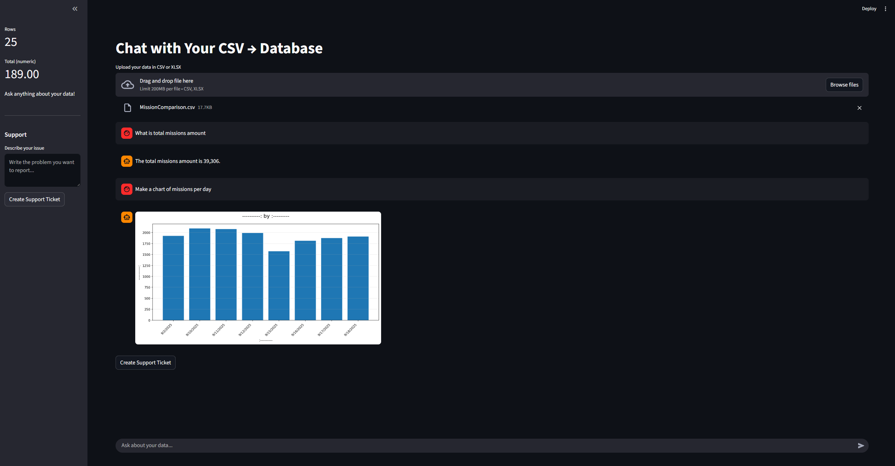

# Chat with Your CSV

## Features
- Upload any CSV
- LLM **infers schema** from first 10 rows
- Creates **SQLite table**
- Inserts **all data**
- Chat with **LangChain agent**
- 2 tools: `run_sql`, `make_chart`, and has a non direct functionality of creating database based on user upload (generating database create SQL)
- **Safe SQL only**
- Support ticket → GitHub

## Screenshots


## Run
```bash
python -m venv venv
source venv/bin/activate
pip install -r requirements.txt
streamlit run app.py

---

## 8. Run & Submit

```bash
streamlit run app.py